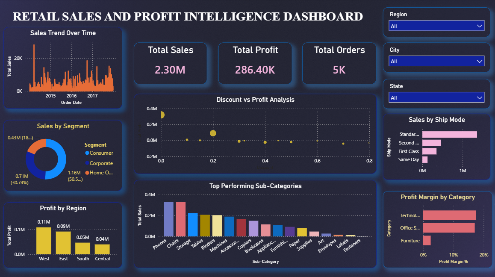
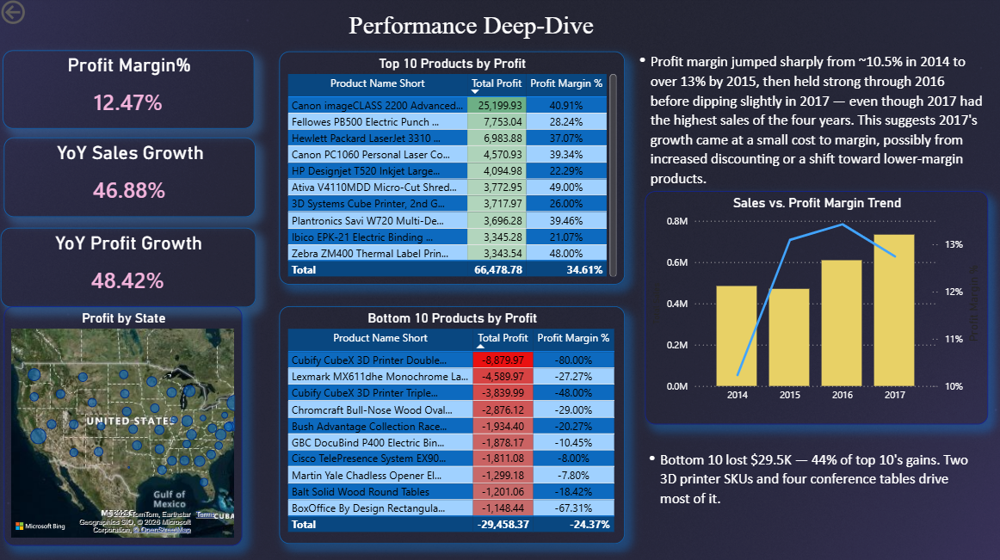

# Retail Sales & Profit Intelligence Dashboard

A 2-page Power BI dashboard analyzing retail sales, profit, and discounting behavior using the Superstore dataset — built to answer one core question: **why does sales growth not always translate into profit growth?**

## Business problem

Retail businesses often track sales growth as a primary success metric, but rising sales can mask shrinking margins, money-losing products, and poor discounting decisions. This dashboard digs past top-line revenue to find exactly where profit is being made — and where it's quietly being lost.

## Dashboard overview

### Page 1 — Sales & Profit Overview
- Sales trend over time, sales by customer segment, profit by region
- Discount vs. profit scatter analysis — flags discount levels where profit turns negative
- Sales by sub-category and ship mode
- Region / City / State filters

### Page 2 — Performance Deep-Dive
- KPIs: Profit Margin %, YoY Sales Growth, YoY Profit Growth
- Profit by state (map)
- Top 10 and Bottom 10 products by profit, with color-scaled tables
- Sales vs. Profit Margin trend (combo chart)
- Drillthrough from Page 1's sub-category chart into filtered product-level detail
- Synced filters across both pages

## Key insights

- **Total sales of 2.30M generated 286.40K in profit — a 12.47% margin**, with sales and profit both growing ~47–48% year-over-year.
- **Bottom 10 products lost $29.5K combined — offsetting 44% of the $66.5K gained by the top 10.** Two Cubify CubeX 3D printer SKUs and four conference/meeting-room tables account for most of that loss, pointing to a pricing or discounting issue concentrated in specific product lines rather than random underperformance.
- **Profit margin peaked at ~13% in 2015 and declined through 2017**, even though 2017 had the highest sales of the four years — meaning recent growth came at a small cost to margin, likely from increased discounting or a shift toward lower-margin products.

## Skills demonstrated

- **Data modeling:** custom date table, relationships, star-schema structure
- **DAX:** YoY growth measures (`SAMEPERIODLASTYEAR`), dynamic Top N / Bottom N filtering, profit margin calculations, conditional text formatting
- **Visualization:** combo charts (dual-axis), filled/bubble maps, conditional formatting (color scales, data bars)
- **UX:** drillthrough navigation, synced slicers across pages, consistent visual theming

## Dataset

Built on the publicly available **Superstore** retail dataset (sales, profit, discount, and order-level data across U.S. regions).

## Files

- `dashboard.pbix` — the full Power BI file
- `Dashboard_overview.png`,`Performance_deep_dive.png` — exported views of both dashboard pages

---
Built by [jidnesh21](https://github.com/jidnesh21)
